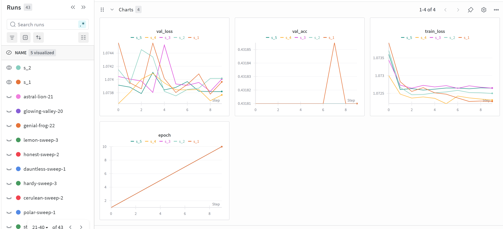
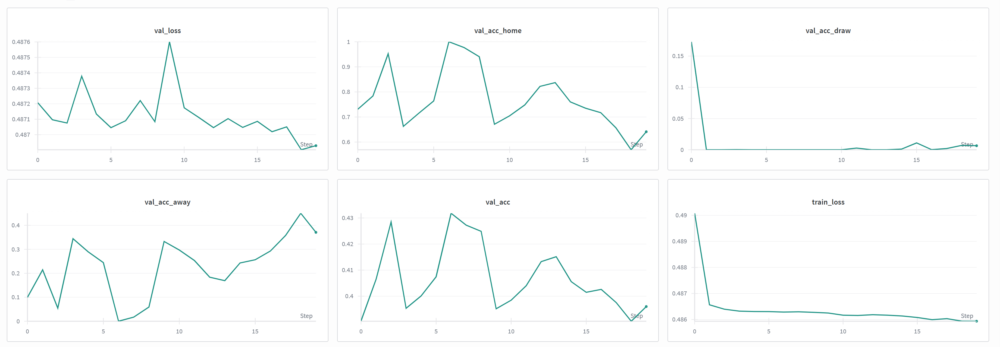
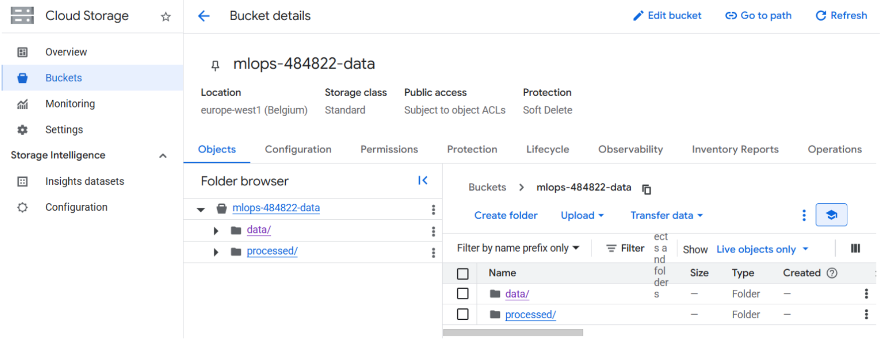
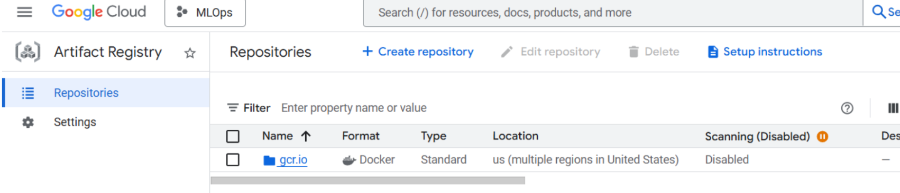
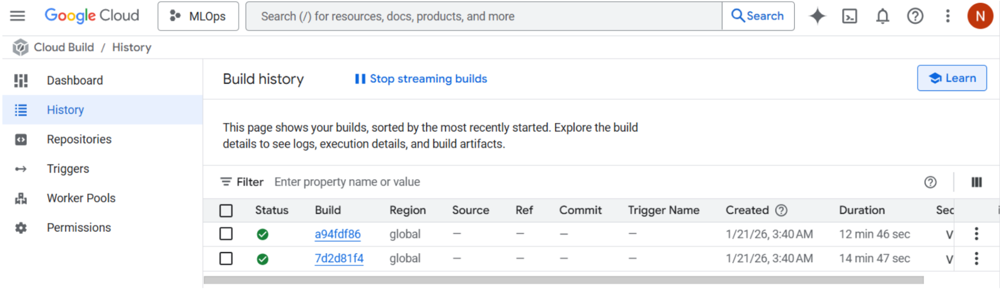
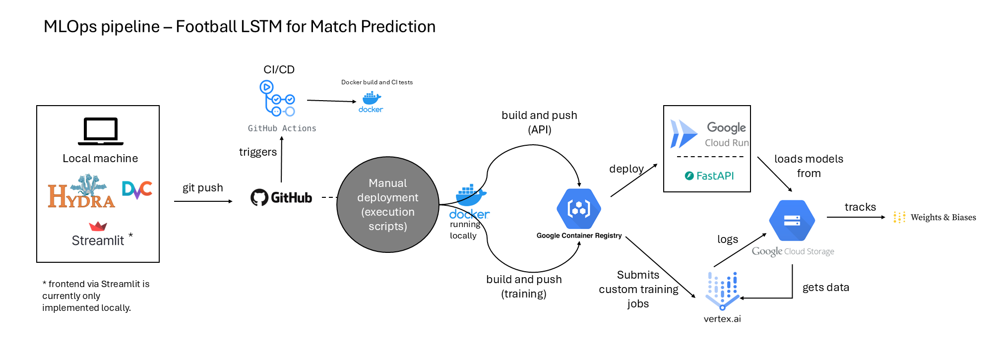

# Exam template for 02476 Machine Learning Operations

This is the report template for the exam. Please only remove the text formatted as with three dashes in front and behind
like:

```--- question 1 fill here ---```

Where you instead should add your answers. Any other changes may have unwanted consequences when your report is
auto-generated at the end of the course. For questions where you are asked to include images, start by adding the image
to the `figures` subfolder (please only use `.png`, `.jpg` or `.jpeg`) and then add the following code in your answer:

``

In addition to this markdown file, we also provide the `report.py` script that provides two utility functions:

Running:

```bash
python report.py html
```

Will generate a `.html` page of your report. After the deadline for answering this template, we will auto-scrape
everything in this `reports` folder and then use this utility to generate a `.html` page that will be your serve
as your final hand-in.

Running

```bash
python report.py check
```

Will check your answers in this template against the constraints listed for each question e.g. is your answer too
short, too long, or have you included an image when asked. For both functions to work you mustn't rename anything.
The script has two dependencies that can be installed with

```bash
pip install typer markdown
```

or

```bash
uv add typer markdown
```

## Overall project checklist

The checklist is *exhaustive* which means that it includes everything that you could do on the project included in the
curriculum in this course. Therefore, we do not expect at all that you have checked all boxes at the end of the project.
The parenthesis at the end indicates what module the bullet point is related to. Please be honest in your answers, we
will check the repositories and the code to verify your answers.

### Week 1

* [X] Create a git repository (M5)
* [X] Make sure that all team members have write access to the GitHub repository (M5)
* [X] Create a dedicated environment for you project to keep track of your packages (M2)
* [X] Create the initial file structure using cookiecutter with an appropriate template (M6)
* [X] Fill out the `data.py` file such that it downloads whatever data you need and preprocesses it (if necessary) (M6)
* [X] Add a model to `model.py` and a training procedure to `train.py` and get that running (M6)
* [X] Remember to either fill out the `requirements.txt`/`requirements_dev.txt` files or keeping your
    `pyproject.toml`/`uv.lock` up-to-date with whatever dependencies that you are using (M2+M6)
* [X] Remember to comply with good coding practices (`pep8`) while doing the project (M7)
* [X] Do a bit of code typing and remember to document essential parts of your code (M7)
* [X] Setup version control for your data or part of your data (M8)
* [X] Add command line interfaces and project commands to your code where it makes sense (M9)
* [X] Construct one or multiple docker files for your code (M10)
* [X] Build the docker files locally and make sure they work as intended (M10)
* [X] Write one or multiple configurations files for your experiments (M11)
* [X] Used Hydra to load the configurations and manage your hyperparameters (M11)
* [X] Use profiling to optimize your code (M12)
* [X] Use logging to log important events in your code (M14)
* [X] Use Weights & Biases to log training progress and other important metrics/artifacts in your code (M14)
* [X] Consider running a hyperparameter optimization sweep (M14)
* [ ] Use PyTorch-lightning (if applicable) to reduce the amount of boilerplate in your code (M15)

### Week 2

* [X] Write unit tests related to the data part of your code (M16)
* [X] Write unit tests related to model construction and or model training (M16)
* [X] Calculate the code coverage (M16)
* [X] Get some continuous integration running on the GitHub repository (M17)
* [X] Add caching and multi-os/python/pytorch testing to your continuous integration (M17)
* [X] Add a linting step to your continuous integration (M17)
* [X] Add pre-commit hooks to your version control setup (M18)
* [X] Add a continues workflow that triggers when data changes (M19)
* [X] Add a continues workflow that triggers when changes to the model registry is made (M19)
* [X] Create a data storage in GCP Bucket for your data and link this with your data version control setup (M21)
* [X] Create a trigger workflow for automatically building your docker images (M21)
* [X] Get your model training in GCP using either the Engine or Vertex AI (M21)
* [X] Create a FastAPI application that can do inference using your model (M22)
* [X] Deploy your model in GCP using either Functions or Run as the backend (M23)
* [X] Write API tests for your application and setup continues integration for these (M24)
* [X] Load test your application (M24)
* [X] Create a more specialized ML-deployment API using either ONNX or BentoML, or both (M25)
* [X] Create a frontend for your API (M26)

### Week 3

* [X] Check how robust your model is towards data drifting (M27)
* [X] Setup collection of input-output data from your deployed application (M27)
* [ ] Deploy to the cloud a drift detection API (M27)
* [X] Instrument your API with a couple of system metrics (M28)
* [X] Setup cloud monitoring of your instrumented application (M28)
* [X] Create one or more alert systems in GCP to alert you if your app is not behaving correctly (M28)
* [ ] If applicable, optimize the performance of your data loading using distributed data loading (M29)
* [ ] If applicable, optimize the performance of your training pipeline by using distributed training (M30)
* [X] Play around with quantization, compilation and pruning for you trained models to increase inference speed (M31)

### Extra

* [X] Write some documentation for your application (M32)
* [ ] Publish the documentation to GitHub Pages (M32)
* [X] Revisit your initial project description. Did the project turn out as you wanted?
* [X] Create an architectural diagram over your MLOps pipeline
* [X] Make sure all group members have an understanding about all parts of the project
* [X] Uploaded all your code to GitHub

## Group information

### Question 1
> **Enter the group number you signed up on <learn.inside.dtu.dk>**
>
> Answer:

Group 123

### Question 2
> **Enter the study number for each member in the group**
>
> Example:
>
> *sXXXXXX, sXXXXXX, sXXXXXX*
>
> Answer:

s254416, s240022

### Question 3
> **Did you end up using any open-source frameworks/packages not covered in the course during your project? If so**
> **which did you use and how did they help you complete the project?**
>
> Recommended answer length: 0-200 words.
>
> Example:
> *We used the third-party framework ... in our project. We used functionality ... and functionality ... from the*
> *package to do ... and ... in our project*.
>
> Answer:

We have not used any open-source frameworks or packages that have not been part of the content on the course website.

## Coding environment

> In the following section we are interested in learning more about you local development environment. This includes
> how you managed dependencies, the structure of your code and how you managed code quality.

### Question 4

> **Explain how you managed dependencies in your project? Explain the process a new team member would have to go**
> **through to get an exact copy of your environment.**
>
> Recommended answer length: 100-200 words
>
> Example:
> *We used ... for managing our dependencies. The list of dependencies was auto-generated using ... . To get a*
> *complete copy of our development environment, one would have to run the following commands*
>
> Answer:

We used requirements.txt and requirements_dev.txt files to manage our dependencies. The core project dependencies, which include the larger torch library, pandas, FastAPI, and Weights & Biases are found in requirements.txt, while development tools such as pytest, ruff, and pre-commit are found in requirements_dev.txt. These requirements files are dynamically incorporated into the pyproject.toml file:

```
[tool.setuptools.dynamic]
dependencies = {file = ["requirements.txt"]}
optional-dependencies.dev = {file = ["requirements_dev.txt"]}
```

To obtain a complete copy of our development environment, one would have to run the following commands:

```
git clone https://github.com/nicosrp/mlops-project
cd mlops-project
python -m venv env
.\env\Scripts\activate
pip install -e .
pip install -e ".[dev]"
```

New dependencies were incorporated manually to the appropriate requirements file as we proceeded through the project to maintain reproducibility.

### Question 5

> **We expect that you initialized your project using the cookiecutter template. Explain the overall structure of your**
> **code. What did you fill out? Did you deviate from the template in some way?**
>
> Recommended answer length: 100-200 words
>
> Example:
> *From the cookiecutter template we have filled out the ... , ... and ... folder. We have removed the ... folder*
> *because we did not use any ... in our project. We have added an ... folder that contains ... for running our*
> *experiments.*
>
> Answer:

From the cookiecutter template, we filled out the src/mlops_project, data/, tests/, models/, notebooks/, and reports/folders with our project-specific code. Additionally, we populated the requirements.txt and requirements_dev.txt files with our specific dependencies and further configured the pyproject.toml file to manage our packages.

We have added several files and folders that contain CI/CD pipelines (ci.yaml for testing, docker.yaml for containerization, and two additional files for data and model changes), Hydra configuration for training (configs/ folder), deployment and sweep utilities (scripts/ folder), Dockerfiles for containerization (train.dockerfile, api.dockerfile), and GCP deployment (cloudbuild.yaml). We also created /env for our virtual environment, wandb/ for experiment tracking on Weights and Biases, .dvc’ for data version control, and utility files like frontend.py for Streamlit visualization and data_drift.py for monitoring.

### Question 6

> **Did you implement any rules for code quality and format? What about typing and documentation? Additionally,**
> **explain with your own words why these concepts matters in larger projects.**
>
> Recommended answer length: 100-200 words.
>
> Example:
> *We used ... for linting and ... for formatting. We also used ... for typing and ... for documentation. These*
> *concepts are important in larger projects because ... . For example, typing ...*
>
> Answer:

We used ruff for linting and automatic formatting, and it is configured in pyproject.toml. Here, ruff enforces import sorting, naming conventions, and ensures our code is PEP8-compliant with a 12-character line length. We also integrated ruff into our pre-commit hooks, where ruff–fix and ruff-format are automatically run before each commit to ensure consistent and high-quality code across the team.

Typing is also implemented throughout our code, where we utilized type hints. Function parameters specify types, such as int and float, and can be seen in scripts like model.py.

These concepts are crucial in larger projects because they ensure consistency across a team, reduce bugs with static type checking, and ensure the code is maintainable over time. Documentation is also important in enabling new team members to quickly understand the system without having to go through the code line-by-line.

## Version control

> In the following section we are interested in how version control was used in your project during development to
> corporate and increase the quality of your code.

### Question 7

> **How many tests did you implement and what are they testing in your code?**
>
> Recommended answer length: 50-100 words.
>
> Example:
> *In total we have implemented X tests. Primarily we are testing ... and ... as these the most critical parts of our*
> *application but also ... .*
>
> Answer:

Across our three test modules, we implemented 17 tests. The data pipeline contains 5 tests (test_data.py) to verify the dataset initialization, length, tensor shapes, label validity, and input dimensions. The LSTM model contains 5 tests (test_model.py) to verify initialization, forward passes, output shapes, different configurations, and parameter counts. The FastAPI application contains 7 tests (test_api.py) that validate the root and health endpoints, prediction endpoint structure, mock model predictions, invalid inputs, error handling when no model is loaded, and incorrect feature dimensions.

These tests ensure that the crucial components of our pipeline–data loading, model architecture, and API serving–function correctly.

### Question 8

> **What is the total code coverage (in percentage) of your code? If your code had a code coverage of 100% (or close**
> **to), would you still trust it to be error free? Explain you reasoning.**
>
> Recommended answer length: 100-200 words.
>
> Example:
> *The total code coverage of code is X%, which includes all our source code. We are far from 100% coverage of our **
> *code and even if we were then...*
>
> Answer:

Our total code coverage is 19%; however, that varies significantly across components. We focused our testing on the most critical parts, namely the dataset class (61% coverage), which validates data loading, sequence construction, and feature extraction across different sequence lengths; the Model class (71% coverage), which e.g., tests forward passes or output shapes; and the API (42% coverage), which verifies endpoint responses, input validation, and error handling with mocked models. Training scripts and utility modules aren't covered as they require full infrastructure. Even with 100% coverage, we wouldn't trust the code to be error-free. Coverage only tells us which lines executed during tests, not whether the logic is actually correct. For example, a test might call a function and check it doesn't crash, but not verify it returns nice values. Coverage also misses integration problems, race conditions, and edge cases that aren't represented in our test data. High coverage is useful as a baseline, but it needs to be combined with meaningful assertions, integration testing, and real-world validation to actually ensure code quality.

### Question 9

> **Did you workflow include using branches and pull requests? If yes, explain how. If not, explain how branches and**
> **pull request can help improve version control.**
>
> Recommended answer length: 100-200 words.
>
> Example:
> *We made use of both branches and PRs in our project. In our group, each member had an branch that they worked on in*
> *addition to the main branch. To merge code we ...*
>
> Answer:

Our workflow primarily involved direct commits to the main branch. As we worked remotely with often momental different tasks, we coordinated through communication and regularly pulled the latest changes with git pull before making our own commits.

This approach worked for our small team since we typically worked on different components, e.g., one focusing on model development and training infrastructure, the other on deployment and API development—which naturally minimized merge conflicts.

However, we see that branches and pull requests would provide significant benefits for larger teams or if we would have been required to work on tasks that are more intertwined with each other than they were in our case. Branches allow a feature development that is better isolated without affecting the main codebase, while pull requests enable code review before merging, where we could catch potential issues.

### Question 10

> **Did you use DVC for managing data in your project? If yes, then how did it improve your project to have version**
> **control of your data. If no, explain a case where it would be beneficial to have version control of your data.**
>
> Recommended answer length: 100-200 words.
>
> Example:
> *We did make use of DVC in the following way: ... . In the end it helped us in ... for controlling ... part of our*
> *pipeline*
>
> Answer:

We implemented DVC to manage the data in our project, tracking our raw dataset of approximately 300 MB across 3 files through a raw.dvc metadata file. This approach is particularly useful with large datasets because it keeps only the small metadatafiles in Git while the large datasets are tracked separately. Because our project is centered on the prediction of match outcomes using historical data and a multitude of features (e.g., league information, team statistics), the dataset can grow quickly as new matches are played or additional features are incorporated into the dataset.

While we configured DVC with Google Drive as the remote storage for team collaboration, authentication limitations with service accounts required us to handle initial data retrieval manually through a shared folder. However, DVC continues to provide essential version tracking locally and ensures that all team members are aligned on the data throughout development.

### Question 11

> **Discuss you continuous integration setup. What kind of continuous integration are you running (unittesting,**
> **linting, etc.)? Do you test multiple operating systems, Python  version etc. Do you make use of caching? Feel free**
> **to insert a link to one of your GitHub actions workflow.**
>
> Recommended answer length: 200-300 words.
>
> Example:
> *We have organized our continuous integration into 3 separate files: one for doing ..., one for running ... testing*
> *and one for running ... . In particular for our ..., we used ... .An example of a triggered workflow can be seen*
> *here: <weblink>*
>
> Answer:

We have organized the continuous integration into four separate workflow files: one for code quality and testing (ci.yaml), one for Docker image building (docker.yaml), and two for change detection (data_changes.yaml, model_changes.yaml). Our main CI pipeline implements comprehensive testing across multiple operating systems (Ubuntu, Windows, and macOS), ensuring compatibility across platforms.

The code quality and testing workflow includes multiple stages: code linting and formatting with ruff, unit testing with pytest, and code coverage reporting using pytest-cov. We use pip caching via GitHub Actions' cache: 'pip' feature, which caches dependencies (requirements.txt and requirements_dev.txt) between runs, which significantly reduces CI runtime and improves efficiency.

For our Docker workflow, we automate the container image building and pushing to GitHub Container Registry on every push to main/master, tagged with both commit SHA and semantic versioning for reproducibility. The containerized environments ensure consistent dependencies and configurations across both the local development and the cloud training infrastructure.

The change detection workflows detect changes to DVC-tracked data and model registry updates, respectively, triggering the appropriate validation steps.

All workflows trigger on push and pull requests to the main branch, validating code quality before merging. Additionally, we have enforced pre-commit hooks locally with ruff, thus catching code and PEP 8 guideline violations before they reach CI.

## Running code and tracking experiments

> In the following section we are interested in learning more about the experimental setup for running your code and
> especially the reproducibility of your experiments.

### Question 12

> **How did you configure experiments? Did you make use of config files? Explain with coding examples of how you would**
> **run a experiment.**
>
> Recommended answer length: 50-100 words.
>
> Example:
> *We used a simple argparser, that worked in the following way: Python  my_script.py --lr 1e-3 --batch_size 25*
>
> Answer:

We used Hydra for experiment configuration with YAML config files stored in the configs directory. The main configuration file, trian.yaml, contains hyperparameters such as batch size, learning rate, and size of the hidden layers, along with training settings like seed=42, and Weights & Biases configuration.

To run an experiment with the default training configurations: python src/mlops_project/train.py

Specific parameters can also be overridden in the command line: python src/mlops_project/train.py hyperparameters.lr=0.001

Environment-specific yaml-configurations were also included, along with sweep.yaml for Weights & Biases hyperparameter sweeps. The hydra decorator (@hydra.main(config_path=”../../configs” config_name=”train.yaml”) is also applied to automatically load and parse configurations.

### Question 13

> **Reproducibility of experiments are important. Related to the last question, how did you secure that no information**
> **is lost when running experiments and that your experiments are reproducible?**
>
> Recommended answer length: 100-200 words.
>
> Example:
> *We made use of config files. Whenever an experiment is run the following happens: ... . To reproduce an experiment*
> *one would have to do ...*
>
> Answer:

We utilized Hydra configuration files (train.yaml) to ensure no information was lost and that experiments were reproducible. Whenever an experiment is run, Hydra: 1) Loads the complete model configuration (including hyperparameters, paths, random seed), 2) Sets torch.manual_seed(cfg.training.seed) for deterministic training, 3) Logs the configuration to Weights & Biases via wandb.init(config=OmegaConf.to_container(cfg)), and 4) Saves the configuration alongside the model checkpoint.

Version control was also used to track code changes using git, so experimental results are associated with a specific version of the code. Weights and Biases tracks all experiment metadata and metrics (training/validation, loss/accuracy). DVC tracked data versions via raw.dvc. Docker ensured reproducible environments. When running on GCP, models are also saved to GCS with timestamps for versioning.

To reproduce an experience, one would:
Checkout the specific git commit.
Pull the correct data version using dvc pull.
Use the logged Weights & Biases configuration or original YAML file.
Run python src/mlops_project/train.py

### Question 14

> **Upload 1 to 3 screenshots that show the experiments that you have done in W&B (or another experiment tracking**
> **service of your choice). This may include loss graphs, logged images, hyperparameter sweeps etc. You can take**
> **inspiration from [this figure](figures/wandb.png). Explain what metrics you are tracking and why they are**
> **important.**
>
> Recommended answer length: 200-300 words + 1 to 3 screenshots.
>
> Example:
> *As seen in the first image when have tracked ... and ... which both inform us about ... in our experiments.*
> *As seen in the second image we are also tracking ... and ...*
>
> Answer:

We tracked experiments using Weights & Biases, logging various metrics to monitor model performance during training. We tracked training and validation metrics by computing training loss, validation loss, and validation accuracy. Monitoring the loss ensured we could detect overfitting if validation loss increased while training loss decreased. Validation accuracy was used to monitor our overall model performance across the three output classes (home win, draw, away win), and we utilized this as our primary optimization metric.

Additionally, we measured pre-class accuracies after we noticed that the model was always predicting home wins. We then noticed that our dataset was imbalanced, as home wins occurred 43.4%, away wins 31.7%, and draws 24.9%. These metrics helped detect if the model is biased towards the majority class or performed poorly on the minority classes.



We utilized the hyperparameter sweeps on Weights & Biases using sweep.yaml to explore various combinations of batch size, learning rate, hidden layer sizes, number of layers, dropout, and sequence lengths (in relation to 5, 10, or 15 historical matches), optimizing for maximum validation accuracy to find the best hyperparameter configuration.

These metrics are monitored because they provide insight into 1) model convergence and stability, 2) class imbalance, 3) optimal hyperparameter configurations, and 4) generalization capability (training versus validation performance). We ended up implementing Focal Loss with gamma=2.0 and square-rooted class weights to address the class imbalance problem, which penalizes easy examples less and focuses the model's learning on hard-to-classify cases, preventing it from simply predicting the majority class, resulting in the following final model results:



### Question 15

> **Docker is an important tool for creating containerized applications. Explain how you used docker in your**
> **experiments/project? Include how you would run your docker images and include a link to one of your docker files.**
>
> Recommended answer length: 100-200 words.
>
> Example:
> *For our project we developed several images: one for training, inference and deployment. For example to run the*
> *training docker image: `docker run trainer:latest lr=1e-3 batch_size=64`. Link to docker file: <weblink>*
>
> Answer:

We developed two Docker images for this project: one for training (train.dockerfile) and one for API deployment (api.dockerfile). Containerization using Docker ensures reproducible environments across deployment, training (both locally and on the cloud), and production deployment.

The training image includes Google Cloud SDK for data/model storage on GCS, installs dependencies compatible with PyTorch 2.0.1 and NumPy<2.0, and sets up the training environment. To run training with custom hyperparameters: docker run -v $(pwd)/data:/app/data train:latest hyperparameters.lr=0.001

The API image is optimized for deployment, containing the FastAPI application, trained model (models/best_model.pth), and includes health checks for Cloud Run compatibility. To run locally:
docker build -f api.dockerfile -t football-api:latest .
docker run -p 8080:8080 football-api:latest

Both the training image and the API images are automatically build via GitHub Actions using docker.yaml and pushed to GitHub Container Reigstry on commits to the main branch. For GCP deployment, we use Cloud Build (cloudbuild.yaml) to build and push to the Google Container Registry, which is then deployed to Cloud Run via deploy_api.py.

### Question 16

> **When running into bugs while trying to run your experiments, how did you perform debugging? Additionally, did you**
> **try to profile your code or do you think it is already perfect?**
>
> Recommended answer length: 100-200 words.
>
> Example:
> *Debugging method was dependent on group member. Some just used ... and others used ... . We did a single profiling*
> *run of our main code at some point that showed ...*
>
> Answer:

For debugging, we primarily used print statements and logging with the Python logging model (log.info(), log.error() throughout train.py to track training progress, configuration values, class weights, and model details. Additionally, we employed try-except blocks in critical areas like API endpoints and GCS model uploads to catch and log errors. For API debugging, we used FastAPI’s automatic error responses and HTTPException with detailed error messages.

We implemented profiling using Python’s cProfile module in profile.py, which can be run via invoke profile. The profiling script analyzes the first 10 training batches, identifying bottlenecks in data loading, forward passes, backward propagation, and optimizer steps. Results are then sorted by cumulative time and then saved to reports/profile_stats.prof. The profiling run revealed that the LSTM forward pass and attention mechanism were the most time-consuming operations, which we had expected for our model architecture, thus concluding that were no major unexpected inefficiencies in our code. Further, we used pytest with coverage report (pytest – cov) to ensure critical components were properly tested.

## Working in the cloud

> In the following section we would like to know more about your experience when developing in the cloud.

### Question 17

> **List all the GCP services that you made use of in your project and shortly explain what each service does?**
>
> Recommended answer length: 50-200 words.
>
> Example:
> *We used the following two services: Engine and Bucket. Engine is used for... and Bucket is used for...*
>
> Answer:

We employed 5 GCP services in our project (id 484822):
Cloud Storage (GCS): This service is used for storing trained models and data with versioning. The models are automatically uploaded to gs://mlops-484822-models/ buckets after training, with timestamped backups for version control (e.g., train.py:241-245)
Container Registry (GCR): Stores the Docker images at gcr.io/mlops-484822/. This was used for both training (football-lstm-trainer) and API (football-api) images, which are pushed via cloudbuild.yaml and deployment scripts.
Cloud Build: Automates the building of Docker images and pushing to GCR. This is configured via cloudbuild.yaml to build the training images with proper tagging (:latest, :$BUILD_ID)
Vertex AI: Executes the distributed training jobs using custom containers. The two scripts, submit_gcp_training.py and submit_gcp_gpu.py, submit the training jobs with configurable machine types and integrate Weights & Biases for experiment tracking.
Cloud Run: Hosts the FastAPI prediction service. It automatically handles traffic scaling and is deployed via deploy_api.py with 2Gi memory and 1 CPU, and is configured for public access.

### Question 18

> **The backbone of GCP is the Compute engine. Explained how you made use of this service and what type of VMs**
> **you used?**
>
> Recommended answer length: 100-200 words.
>
> Example:
> *We used the compute engine to run our ... . We used instances with the following hardware: ... and we started the*
> *using a custom container: ...*
>
> Answer:

We did not directly use the Compute Engine VMs, but instead leveraged the Compute Engine as the underlying infrastructure via Vertex AI for our training jobs, as Vertex AI manages Compute Engine VMs automatically for custom training jobs.

We used n1-standard-4 machine types (4 vCPUs, 15GB RAM) for both CPU and GPU training. For GPU-accelerated training, we configured instances with an NVIDIA Tesla T4 GPU attached to the n1-standard-4-based machine (submit_gcp_gpu.py). Since our dataset is fairly small (<1GB), GPU-accelerated training wasn’t strictly necessary, and GCP typically defaulted to CPU training. While our model achieved moderate performance, utilization of GPU-accelerated training with hyperparameter optimization may have further improved results.

All jobs ran using custom Docker containers (train.dockerfile) that contained our training code, PyTorch, and dependencies. The Vertex AI service automatically started VMs from the Container Registry images (gcr.io/mlops-484822/football-lstm-trainer), executed the training with the environment variables (including the Weights & Biases API keys), uploaded trained models to Cloud Storage, and terminated the instances after completion. This approach provided flexibility of the Compute Engine without manual VM management and ensured cost-efficiency.

### Question 19

> **Insert 1-2 images of your GCP bucket, such that we can see what data you have stored in it.**
> **You can take inspiration from [this figure](figures/bucket.png).**
>
> Answer:



### Question 20

> **Upload 1-2 images of your GCP artifact registry, such that we can see the different docker images that you have**
> **stored. You can take inspiration from [this figure](figures/registry.png).**
>
> Answer:



### Question 21

> **Upload 1-2 images of your GCP cloud build history, so we can see the history of the images that have been build in**
> **your project. You can take inspiration from [this figure](figures/build.png).**
>
> Answer:



### Question 22

> **Did you manage to train your model in the cloud using either the Engine or Vertex AI? If yes, explain how you did**
> **it. If not, describe why.**
>
> Recommended answer length: 100-200 words.
>
> Example:
> *We managed to train our model in the cloud using the Engine. We did this by ... . The reason we choose the Engine*
> *was because ...*
>
> Answer:

We trained our model using Vertex AI because it provides managed infrastructure for custom training jobs, automatically handling VM provisioning, job orchestration, and resource cleanup. Further, Vertex AI integrates well with other GCP services, such as Container Registry and Cloud Storage, thus providing simple job monitoring through the console and logs. Additionally, it supports CPU and GPU training, along with ensuring cost-efficiency by automatically terminating resources following completion of the job.

Our workflow involved 3 key steps:
Build and push Docker image: Our training code was containerized using train.dockerfile, then build and pushed to Google Container Registry using submit_gcp_training.py or submit_gcp_gpu.py
Submit Vertex AI job: The scripts create custom training jobs with n1-standard-4 machines (optionally with T4 GPUs), passing the Weights & Biases API keys as environmental variables, and utilize train_gcp.yaml for configuration.
Automatic artifact storage: Models are automatically uploaded to Cloud Storage buckets (mlops-484822-models) with timestamped versions after training is complete.

## Deployment

### Question 23

> **Did you manage to write an API for your model? If yes, explain how you did it and if you did anything special. If**
> **not, explain how you would do it.**
>
> Recommended answer length: 100-200 words.
>
> Example:
> *We did manage to write an API for our model. We used FastAPI to do this. We did this by ... . We also added ...*
> *to the API to make it more ...*
>
> Answer:

We successfully wrote an API for our model using FastAPI, implementing several key features:

- **Core prediction endpoint** (`/predict`): Accepts historical match features (sequential data), performs inference using the LSTM model, and returns the predicted outcome (home/draw/away) with the class probabilities.
- **Pydantic models for input validation**: PredictionInput and PredictionOutput ensure type safety and automatic API documentation.
- **ONNX Runtime support**: The API supports both ONNX Runtime and PyTorch model loading with automatic fallback to PyTorch if ONNX should be unavailable
- **Prometheus metrics integration**: Added monitoring via prometheus-fastapi-instrumentator, thus tracking prediction counts per outcome, probability distributions, inference duration, model load status, and error types. These metrics are found at `/metrics` for the monitoring dashboards.
- **Automatic model loading**: The model loads models/best_model.pth (or .onnx) on startup, extracting hyperparameters from the checkpoint.
- **Data drift monitoring**: Generates Evidently reports comparing recent predictions against the reference data, detecting data quality issues and data distribution shifts.
- **Prediction logging**: Background tasks asynchronously log all predictions to a CSV database for later analysis
- **Health checks**: Monitor API and model status for deployment orchestration

The API is containerized with api.dockerfile and deployed to Google Cloud Run with automatic documentation at `/docs`.

### Question 24

> **Did you manage to deploy your API, either in locally or cloud? If not, describe why. If yes, describe how and**
> **preferably how you invoke your deployed service?**
>
> Recommended answer length: 100-200 words.
>
> Example:
> *For deployment we wrapped our model into application using ... . We first tried locally serving the model, which*
> *worked. Afterwards we deployed it in the cloud, using ... . To invoke the service an user would call*
> *`curl -X POST -F "file=@file.json"<weburl>`*
>
> Answer:

The API was successfully deployed, both locally and to the cloud.

We wrapped our model in a FastAPI application and tested it for local deployment using:
Uvicorn mlops_project.api:app –host 0.0.0.0 –port 8000

For the cloud, we deployed to Google Cloud Run using deploy_api.py, which 1) builds the Docker image using api.dockerfile with the trained model, 2) pushes to Google Container Registry, and 3) deploys to Cloud Run. The service is accessible at https://football-api-617960074163.europe-west1.run.app. Users can make POST requests to invoke the service, calling
curl -X POST “https://football-api-617960074163.europe-west1.run.app/predict” \
	-H “Content-Type: application/json” \
	-d ‘{“features”: [[0.5, 0.3, …], [0.7, 0.2, …]]}’

Additionally, we build a Streamlit frontend (frontend.py) to provide a user-friendly interface to the API, allowing users to input match data and obtain prediction outputs without the usage of curl commands.

### Question 25

> **Did you perform any unit testing and load testing of your API? If yes, explain how you did it and what results for**
> **the load testing did you get. If not, explain how you would do it.**
>
> Recommended answer length: 100-200 words.
>
> Example:
> *For unit testing we used ... and for load testing we used ... . The results of the load testing showed that ...*
> *before the service crashed.*
>
> Answer:

Both unit testing and load testing are implemented for our API.

For unit testing, we used pytest with FastAPI’s TestClient to test 7 different API scenarios: root and health endpoints functionality, prediction endpoint structure and response validation, mocked model predictions with proper probability distributions, invalid input handling (422 validation errors), model not loaded error handling (503 status), and wrong feature dimension error handling (400 status). The unit tests utilize pytest fixtures and monkeypatching to mock the model without requiring the actual trained model file, thus ensuring tests can run reliably in CI/CD pipelines.

For load testing, we used Locust to simulate concurrent users making requests to the API. The load testing configuration includes: simulated users with 1-3 second wait times between requests, weighted tasks (e.g., prediction endpoint, health check, root endpoint), and random feature generation to simulate realistic traffic. To run load testing: locust -f tests/locustfile.py –host=https://football-api-617960074163.europe-west1.run.app

The Cloud Run deployment with auto-scaling handled moderate concurrent loads effectively, with the service automatically scaling instances based on traffic demand.

### Question 26

> **Did you manage to implement monitoring of your deployed model? If yes, explain how it works. If not, explain how**
> **monitoring would help the longevity of your application.**
>
> Recommended answer length: 100-200 words.
>
> Example:
> *We did not manage to implement monitoring. We would like to have monitoring implemented such that over time we could*
> *measure ... and ... that would inform us about this ... behaviour of our application.*
>
> Answer:

We implemented monitoring for our deployed model using numerous approaches to ensure model health, performance tracking, and early detection of data distribution shifts:

Prometheus Metrics: We tracked predictions_total as a counter for predictions by outcome, prediction_probability to monitor the distribution of model confidence scores, model_inference_duration_second for inference latency histogram, model_loaded to gauge model availability, and prediction_errors_total to track errors by type (invalid_input, model_not_loaded, unknown)
Prediction Logging: Background tasks asynchronously log all predictions, including features, outputs, probabilities, and timestamps, to a CSV database for offline analysis
Data Drift Monitoring: Using Evidently, the endpoint generates interactive HTML reports comparing recent predictions against reference data to detect feature distribution shifts (data drift), data quality issues (missing values or outliers), and target drift (changes in the prediction distribution).
Cloud monitoring: Configured GCP Cloud Monitoring alerts for high error rates, latency spikes, and container crashes.

## Overall discussion of project

> In the following section we would like you to think about the general structure of your project.

### Question 27

> **How many credits did you end up using during the project and what service was most expensive? In general what do**
> **you think about working in the cloud?**
>
> Recommended answer length: 100-200 words.
>
> Example:
> *Group member 1 used ..., Group member 2 used ..., in total ... credits was spend during development. The service*
> *costing the most was ... due to ... . Working in the cloud was ...*
>
> Answer:

Group member 1 used approximately 2% of the 1,900 kr credits allotted on GCP (around 38 kr). The most expensive service was Vertex AI training due to running multiple training experiments. The next most expensive service was Cloud Storage, used for storing the datasets and model artifacts. Minimal costs were incurred by Cloud Run for API deployment and Cloud Monitoring for alerts.

We believe that working in the cloud is highly beneficial for an MLOps project overall. Despite our low usage (primarily attributed to our fairly small dataset and relatively simple model with minimal hyperparameters), the pay-as-you-go model was advantageous due to our reliance on CPU instances. Working in the cloud provided a more seamless integration between numerous services. For example, training on Vertex AI automatically uploaded the models to CSS, which Cloud Run could access for serving.

However, we found the learning curve quite steep and recognize that the cost of utilizing cloud services can rise quickly without adequate monitoring, particularly regarding GPU consumption. Nonetheless, working in the cloud has allowed us to exercise professional MLOps practices across multiple devices that would otherwise be difficult to replicate in a purely local setup.

### Question 28

> **Did you implement anything extra in your project that is not covered by other questions? Maybe you implemented**
> **a frontend for your API, use extra version control features, a drift detection service, a kubernetes cluster etc.**
> **If yes, explain what you did and why.**
>
> Recommended answer length: 0-200 words.
>
> Example:
> *We implemented a frontend for our API. We did this because we wanted to show the user ... . The frontend was*
> *implemented using ...*
>
> Answer:

We implemented a frontend for our API, creating an interactive web interface using Streamlit that allows football fans to easily input match data and obtain predictions without any coding knowledge. The frontend features a user-friendly form for inputting the last 10 matches for both teams (including goals, ratings, and home/away status), and looks at a couple of historical match sequences from our validation set for demonstration purposes. The frontend is configured to communicate with our deployed Cloud Run endpoint (https://football-api-617960074163.europe-west1.run.app) or can use localhost for local testing.

We also implemented data drift detection with Evidently. We noticed that the distribution of our dataset is skewed towards home wins, thus drift detection is crucial to monitor if the prediction distributions shift over time, to detect when input feature distributions change, and ensure that model predictions remain reliable in production.

We didn't deploy the Streamlit frontend separately, primarily running it locally for demonstration purposes.

### Question 29

> **Include a figure that describes the overall architecture of your system and what services that you make use of.**
> **You can take inspiration from [this figure](figures/overview.png). Additionally, in your own words, explain the**
> **overall steps in figure.**
>
> Recommended answer length: 200-400 words
>
> Example:
>
> *The starting point of the diagram is our local setup, where we integrated ... and ... and ... into our code.*
> *Whenever we commit code and push to GitHub, it auto triggers ... and ... . From there the diagram shows ...*
>
> Answer:



The starting point of the diagram is our local setup, where we integrated several tools into our workflow: DVC for data version control, Hydra for configuration management, pre-commit hooks with ruff for code quality, pytest for testing, and Docker for containerization. Our code is structured using the MLOps cookiecutter template with separate modules for data processing, model training, and API serving.

When we commit and push code to our GitHub repo, it automatically triggers our CI/CD pipeline via GitHub Actions. The CI workflow runs 28 unit tests (across data, model, and API), linting with ruff, and code coverage reporting across three operating systems (Ubuntu, Windows, and macOS). Simultaneously, the Docker workflow builds containerized images and pushes them to the Google Container Registry.

For training, we used Vertex AI on GCP with custom Docker containers running on n1-standard-4 VMs (with the option for T4 GPUs). The training process pulls data from our repository, uses hyperparameters from the Hydra configurations, and logs all experiments on Weights & Biases, tracking metrics including loss and accuracy. Further, hyperparameter sweeps were performed on Weights & Biases. Trained models are then automatically uploaded to Cloud Storage with versioning and timestamped backups.

The trained model is then deployed to Cloud Run via FastAPI application with the model in the Docker image, in addition to deployment via Streamlit frontend for a user-friendly interface for football match predictions.

Monitoring is implemented at multiple levels with Prometheus metrics, Evidently to detect data drift, and Cloud monitoring, alerting us of high error rates, latency spikes, or container crashes. All predictions are logged to a database for offline analysis and potential model retraining.

### Question 30

> **Discuss the overall struggles of the project. Where did you spend most time and what did you do to overcome these**
> **challenges?**
>
> Recommended answer length: 200-400 words.
>
> Example:
> *The biggest challenges in the project was using ... tool to do ... . The reason for this was ...*
>
> Answer:

We struggled with setting up DVC with Google Drive, the git extension that keeps track of the small metafiles that point to the large datafiles, due to various authentication issues with the Google Drive API. This took up a lot of our time, as we continued to move to different aspects of the project, but would return to attempting to configure DVC. We view this as an incredibly useful tool, particularly as datasets grow in size. However, we were fortunate to select a small dataset that was less than 1GB, and the lack of DVC usage did not hamper our project.

During model training, we struggled to identify effective parameters, as the model either predicted only the majority class or exhibited unstable oscillations when different class-weighting schemes were applied. As a result, validation accuracy remained consistently around 43%, corresponding to the majority class (home wins). However, the original dataset is imbalanced, which adversely affects the training of the model. To address this issue, we implemented square root smoothed class weights to stabilize training and chose to focus on infrastructure deployment rather than running additional hyperparameter sweeps, as further sweeps were computationally expensive and did not yield consistent or meaningful improvements. We selected hyperparameters manually, since the sweeps did not yield distinguishable differences in validation accuracy.

### Question 31

> **State the individual contributions of each team member. This is required information from DTU, because we need to**
> **make sure all members contributed actively to the project. Additionally, state if/how you have used generative AI**
> **tools in your project.**
>
> Recommended answer length: 50-300 words.
>
> Example:
> *Student sXXXXXX was in charge of developing of setting up the initial cookie cutter project and developing of the*
> *docker containers for training our applications.*
> *Student sXXXXXX was in charge of training our models in the cloud and deploying them afterwards.*
> *All members contributed to code by...*
> *We have used ChatGPT to help debug our code. Additionally, we used GitHub Copilot to help write some of our code.*
> Answer:

Student s254416 was in charge of setting up the initial cookiecutter template and developing the scripts for loading and processing the data. The student implemented the LSTM model, integrating Weights and Biases, Hydra, and logging. Student s240022 led the continuous integration and development efforts, implementing pre-commit hooks and caching mechanisms. Additionally, the student also developed the fastAPI and frontend of the application. All members contributed to the training of the model and deploying the model on GCP. All members contributed to the writing of the project report.

We used ChatGPT and Claude to assist with debugging the code. Both tools were also used to clarify concepts and provide guidance on the usage of tools, such as Weights and Biases, prior to their implementation in scripts.
